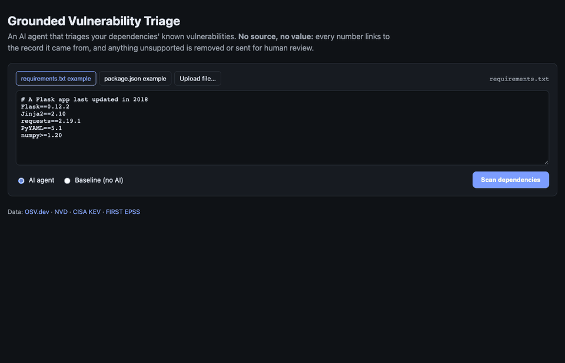

# Grounded Vulnerability Triage Agent

Give it a `requirements.txt` or `package.json`. An LLM agent finds the known vulnerabilities in your dependencies, judges how urgent each one is, and writes a prioritized fix report.

**No source, no value.** Every claim in the report must cite the record it came from, and an automated checker verifies each claim against what the tools actually returned. A claim with no source, a source that was never fetched, or a value that doesn't match its source is removed, and the item goes to human review instead of being guessed at.



## Why this exists

LLMs are good at the judgment part of vulnerability triage, like "this is actively exploited, fix it first". But they also confidently invent CVE numbers, CVSS scores and fixed versions. In security, a made-up "fixed in 2.4.1" is worse than no answer. This project keeps the model's judgment and checks every fact it states.

## How it works

```
manifest ──► parser ──► agent (LLM + tools) ──► submit_report ──► grounding checker ──► report
                         │                                            ▲
                         ▼                                            │
              OSV · NVD · CISA KEV · EPSS ──► evidence ledger ────────┘
```

| Source | Used for | Key |
|---|---|---|
| [OSV.dev](https://osv.dev) | Which vulnerabilities affect `package@version`, fixed versions | none |
| [NVD](https://nvd.nist.gov) | CVSS base score and severity | optional (raises the rate limit) |
| [CISA KEV](https://www.cisa.gov/known-exploited-vulnerabilities-catalog) | Is it being exploited in the wild? | none |
| [FIRST EPSS](https://www.first.org/epss/) | Probability of exploitation in the next 30 days | none |

1. **Parser** (`triage/parsers.py`) turns the manifest into `(ecosystem, name, version)`. Unpinned or range specs (`flask>=2.0`, `"express": "*"`) aren't guessed. They go straight to the review list.
2. **Agent** (`triage/agent.py`, `triage/gemini_agent.py`) gets six tools: `osv_lookup`, `nvd_lookup`, `kev_lookup`, `epss_lookup`, `check_upgrade`, `submit_report`. The model decides what to call. Every result includes the URL it came from. The report is a strict JSON schema (Pydantic), and malformed reports go back to the model as tool errors.
3. **Evidence ledger** (`triage/evidence.py`) records every fact any tool returned during the scan, keyed by source URL and subject.
4. **Grounding checker** (`triage/checker.py`), the core of the project, assigns each claim one of these statuses:
   - `verified`: the cited URL was fetched in this scan, it's about *this* vulnerability, and the value matches
   - `unknown`: the model said it couldn't find the value (allowed; goes to review)
   - `unsourced` / `ungrounded` / `mismatch`: **removed** from the report

   It also **rejects findings** for vulnerabilities OSV never returned for that version (hallucinated or wrong-version CVEs). It **re-adds anything OSV returned that the agent skipped**, and **re-queries OSV** to confirm each recommended upgrade really clears the issues.
5. **Baseline** (`triage/baseline.py`) is the same pipeline with no AI. It's the ground truth for the eval and a fallback mode in the UI.

Priority uses a published rubric (`triage/rubric.py`). The agent may deviate with a written reason, and the eval measures how often it agrees:

| | Rule |
|---|---|
| **P1** fix now | in CISA KEV, or EPSS ≥ 0.50, or CVSS ≥ 9.0 and EPSS ≥ 0.10 |
| **P2** this sprint | CVSS ≥ 7.0, or EPSS ≥ 0.10 |
| **P3** plan a fix | CVSS ≥ 4.0 |
| **P4** low | CVSS < 4.0 |

## Results

Evaluated on 18 dependency files in [`eval/cases`](eval/cases) (10 PyPI, 8 npm). They include old versions with known CVEs, 4 files with actively exploited (KEV) vulnerabilities, 2 fully up-to-date files where any finding is a false alarm, a made-up package name, files with unpinned versions, and a 31-vulnerability stress test. Ground truth comes from the no-AI baseline, plus a hand-labeled list of well-known CVEs each file must surface ([`eval/labels.json`](eval/labels.json)).

<!-- RESULTS:START -->
Model: `gemini-3.6-flash` (Google Gemini free tier). **Progress: 5 of 18 cases evaluated so far** - the free tier allows ~20 requests per model per day, so the remaining cases run as the quota resets (`python -m eval.run_eval --resume`).

Generated 2026-09-30 21:16 over 5 test manifests.

| Metric | Result |
|---|---|
| Recall vs. OSV ground truth | **100.0%** (37/37) |
| Recall on hand-labelled must-find CVEs | **100.0%** (18/18) |
| False alarms (vulns not affecting that version) | **0** |
| Unsupported claims submitted by the model | **0** of 222 (0.0%) |
| Unsupported claims in the final report | **0** (removed by the checker) |
| Claims honestly marked unknown | 0 (of which evidence existed: 0) |
| Actively exploited (KEV) items ranked P1 | 2/2 |
| Priority agreement with rubric | 100.0% |
| Upgrade recommendations confirmed by OSV | 12/12 |
| Runs that errored | 0 |
| Total cost / avg time per manifest | $0.00 / 70.1s |

Per-case breakdown: [`eval/results/gemini-3.6-flash/RESULTS.md`](eval/results/gemini-3.6-flash/RESULTS.md). Full agent traces and checked reports: [`eval/results/gemini-3.6-flash/runs/`](eval/results/gemini-3.6-flash/runs/).
<!-- RESULTS:END -->

**How to read this:** "Unsupported claims submitted by the model" is the raw hallucination rate *before* the checker. The checker removes all of them, so the final report contains **zero** unsupported claims by construction. That's the point: the model doesn't need to be perfect, because nothing unchecked reaches the reader.

## Run it

```bash
python -m venv .venv && source .venv/bin/activate
pip install -r requirements-dev.txt
cp .env.example .env        # add GEMINI_API_KEY (free tier) or ANTHROPIC_API_KEY

# no AI, no key needed
python -m triage.cli baseline examples/requirements.txt

# the agent
python -m triage.cli scan examples/package.json --out report.md

# web UI + API on http://localhost:8000
(cd web && npm install && npm run build)
uvicorn triage.server:app

# tests (offline, no API calls) and the eval
pytest
python -m eval.run_eval --resume
```

Or with Docker:

```bash
docker compose up --build    # http://localhost:8000
```

### Models

The agent runs on **Claude** (`ANTHROPIC_API_KEY`, default `claude-opus-5-5`, with adaptive thinking, strict tool schemas, prompt caching, and server-side refusal fallback) or **Google Gemini** (`GEMINI_API_KEY`, default `gemini-3.5-flash`, which works on the free tier). Both share the same tools, prompt, ledger, and checker. Set `TRIAGE_PROVIDER` to choose when both keys are present.

Gemini's free tier allows about 20 requests per model per day, and one file takes about 6. `eval/run_eval.py --resume` saves each finished case so a full run can span several days at no cost.

## Tests

`pytest` runs 25 offline tests, no network or API calls. They include adversarial checker tests that submit fabricated reports (wrong CVSS, URLs never fetched, a real URL about a *different* CVE, invented CVE ids, wrong installed version, fake fixed versions, unfixable upgrade recommendations) and confirm that each is caught. The agent loop is tested with a scripted fake model client.

## Project layout

```
triage/        parsers, data sources, evidence ledger, checker, agents, API server
eval/          18 test manifests, hand labels, eval runner, results
tests/         offline unit tests
web/           React (Vite) front end
```

## Limitations

- npm range specs (`^4.17.1`) are checked at the lowest allowed version. A lock file would give the exact installed version.
- Vulnerabilities without a CVE id (some GHSA-only advisories) can't be looked up in NVD/KEV/EPSS, so they're always flagged for review.
- The checker verifies facts, not judgment: a priority can be well sourced and still debatable. That's why rubric agreement is reported separately.
